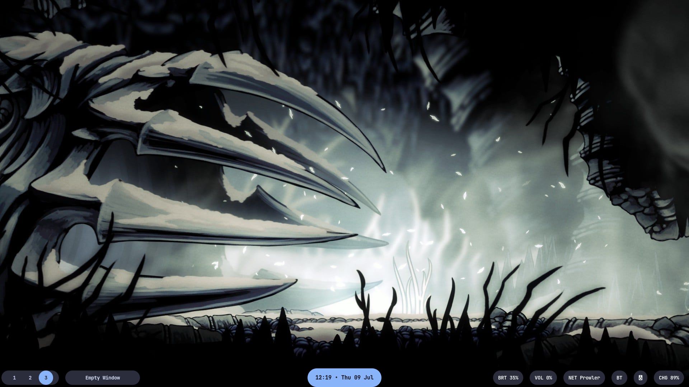
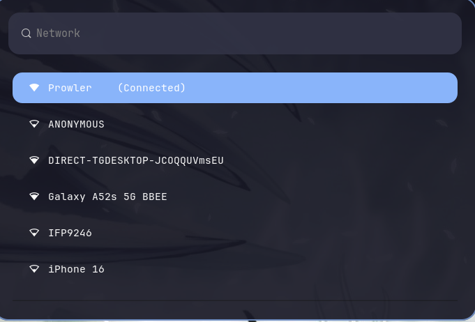
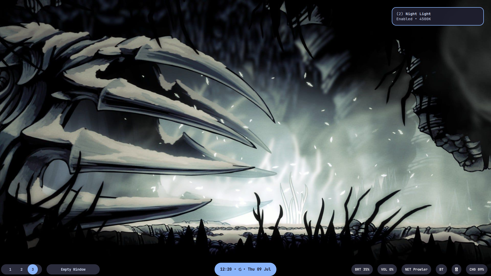
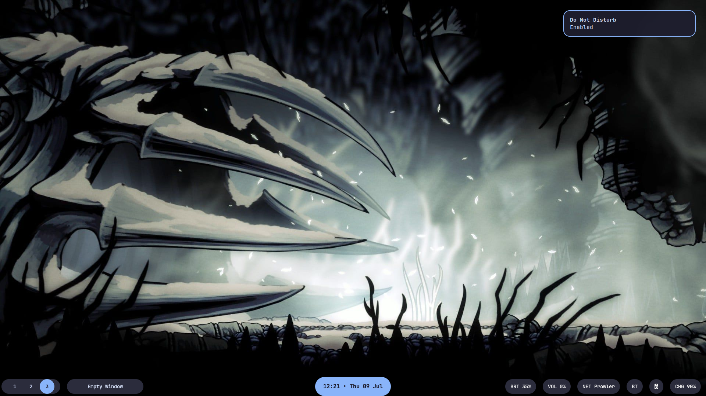

<p align="center">
  
</p>

<h1 align="center">Monarch-Sway</h1>

<p align="center">
  A clean, minimal and modular SwayWM desktop built for productivity, consistency and polished Wayland workflows.
</p>

<p align="center">
  
  
  
</p>

<p align="center">
  Minimal • Fast • Modular • Professional
</p>

---

# Overview

Monarch-Sway is a productivity-focused SwayWM configuration built around a clean dark interface with soft blue accents inspired by Material Expressive design and Omarchy-inspired minimalism.

The goal is to create a desktop that feels:

- Minimal
- Consistent
- Lightweight
- Readable
- Modular
- Professional

Monarch emphasizes keyboard-first workflows, fast access to everyday system controls and a cohesive user experience while remaining lightweight and modular.

This setup prioritizes usability first and aesthetics second.

---

# What's New in v1.2

Monarch-Sway v1.2 is a refinement-focused release that improves workflow integration, desktop usability and overall consistency while preserving the original Monarch philosophy.

## Productivity

- Monarch Network Manager (`Mod + I`)
- Quick File Search (`Mod + Shift + F`)
- Clipboard History (`Mod + V`)
- Improved workflow menus

## Display & Power

- Night Light Improvements (`Mod + X`)
- Caffeine Mode Improvements (`Mod + C`)
- Display Settings submenu (`Mod + Esc`)
- Performance Profile menu (`Mod + P`)
- Clickable Power Profile indicator
- Improved Power Profile workflow

## Notifications

- Proper Do Not Disturb
- Reliable Night Light notifications
- Reliable Caffeine notifications
- Battery level notifications
- Charging state notifications
- Screenshot notifications
- Recording notifications

## UI

- Waybar status indicators
- Night Light indicator
- Caffeine indicator
- DND indicator
- Improved Network workflow
- Improved Waybar consistency
- Numerous workflow refinements

---

# Gallery

## Desktop


---

## Monarch Network Manager



---

## Night Light



---

## Night Light Indicator


---

## Caffeine Mode


---

## Caffeine Indicator


---

## Do Not Disturb



---

## DND Indicator


---

# Original v1.1 Preview

## Desktop


## Display Settings


## Night Light


## Caffeine Mode


## Quick File Search


---

# Original v1.0 Preview

## Desktop


## Waybar


## Launcher


## Power Menu


## Power Profiles


## Fastfetch


---

# Features

## Core Features (v1.0)

- Clean soft-blue accent UI
- Minimal SwayWM workflow
- Custom modular Waybar setup
- Transparent Waybar styling
- Wofi launcher customization
- Wallpaper picker integration
- Performance menu integration
- Power profile selector
- Do Not Disturb toggle
- Screenshot and recording workflow
- Fastfetch branding
- Mako notifications
- Blur-style lockscreen integration
- Consistent styling across all components

## New Features (v1.1)

- Night Light presets
- Caffeine Mode presets
- Display Settings menu
- Quick File Search
- Clipboard History
- Battery notifications
- Charging notifications
- Transparent Waybar

## New Features (v1.2)

- Monarch Network Manager
- Automatic Wi-Fi reconnect
- Waybar Network integration
- Night Light status indicator
- Caffeine status indicator
- DND status indicator
- Clickable Power Profile
- Improved notification system
- Improved Night Light workflow
- Improved Caffeine workflow
- Better Waybar integration
- Numerous bug fixes and workflow improvements

---

# Stack

| Component | Package |
|-----------|---------|
| Window Manager | Sway |
| Status Bar | Waybar |
| Launcher | Wofi |
| Terminal | Foot |
| Notifications | Mako |
| Shell | Zsh |
| Fetch Utility | Fastfetch |

---

# Dependencies

## Core Packages

- sway
- waybar
- wofi
- foot
- mako
- fastfetch
- zsh

## Utilities

- grim
- slurp
- wl-clipboard
- brightnessctl
- playerctl
- network-manager
- pavucontrol
- pipewire / pactl
- swaybg
- swayidle
- swaylock
- nmcli
## Additional v1.2 Dependencies

- gammastep
- cliphist
- blueman
- wf-recorder
- nautilus
- power-profiles-daemon

### Ubuntu / Debian Example

```bash
sudo nala install \
  sway \
  waybar \
  wofi \
  foot \
  mako-notifier \
  fastfetch \
  zsh \
  grim \
  slurp \
  wl-clipboard \
  brightnessctl \
  playerctl \
  network-manager \
  pavucontrol \
  swaybg \
  swayidle \
  swaylock \
  blueman \
  wf-recorder \
  nautilus \
  power-profiles-daemon \
  gammastep
```

---

# Installation

Clone the repository:

```bash
git clone https://github.com/sharanfr/Monarch-Sway.git
cd Monarch-Sway
```

Create the configuration directory:

```bash
mkdir -p ~/.config
```

Copy the configuration folders:

```bash
cp -r foot ~/.config/
cp -r mako ~/.config/
cp -r sway ~/.config/
cp -r swaylock ~/.config/
cp -r waybar ~/.config/
cp -r wofi ~/.config/
cp -r fastfetch ~/.config/
```

Reload Sway:

```bash
swaymsg reload
```

or simply log out and log back into your Wayland session.

---

# Folder Structure

```text
Monarch-Sway
├── docs/
├── fastfetch/
├── foot/
├── mako/
├── screenshots/
│   └── v1.2/
├── sway/
├── swaylock/
├── waybar/
├── wofi/
├── CHANGELOG.md
├── LICENSE
└── README.md
```

---

# Keybindings

The full list of keybindings is available in:

```text
docs/keybindings.md
```

## New v1.2 Keybindings

| Shortcut | Action |
|-----------|--------|
| Mod + I | Monarch Network Manager |
| Mod + X | Night Light |
| Mod + C | Caffeine Mode |
| Mod + P | Performance Profiles |
| Mod + Esc | Display Settings |
| Mod + Shift + F | Quick File Search |
| Mod + V | Clipboard History |
| Mod + F4 | Toggle Do Not Disturb |

Additional shortcuts include:

- Application Launcher
- Terminal
- File Manager
- Screenshot Workflow
- Screen Recording
- Workspace Switching
- Power Menu
- Wallpaper Picker
- Lockscreen
- Brightness Controls
- Volume Controls
- Window Management

---

# Customization

## Sway

Main configuration:

```text
sway/config
```

Scripts:

```text
sway/scripts/
```

---

## Waybar

Modules:

```text
waybar/config
```

Styling:

```text
waybar/style.css
```

Scripts:

```text
waybar/scripts/
```

---

## Wofi

Configuration:

```text
wofi/config
```

Styling:

```text
wofi/style.css
```

---

## Notifications

```text
mako/config
```

---

## Terminal

```text
foot/foot.ini
```

---

## Lockscreen

```text
swaylock/config
```

---

## Fastfetch

```text
fastfetch/
```

---

# Wallpaper

Wallpaper behavior is configured inside:

```text
sway/config
```

Additional wallpaper utilities are located in:

```text
sway/scripts/
```

Users are encouraged to replace the default wallpaper with one that suits their setup.

---

# Notes

Monarch-Sway has been developed and tested primarily on:

- Ubuntu 24.04 LTS
- SwayWM
- Wayland
- NetworkManager
- PipeWire

Depending on your distribution, package names may differ slightly.

Some scripts may require minor adjustments depending on:

- Display resolution
- Multi-monitor layouts
- Tray implementation
- Audio backend
- Wallpaper locations
- Bluetooth backend
- GPU driver configuration

---

# Release History

## v1.0

Initial public release featuring the core Monarch workflow.

### Highlights

- Modular Waybar
- Performance Profiles
- Wallpaper Picker
- Fastfetch Branding
- Screenshot Workflow
- Mako Notifications
- Power Menu
- Blur Lockscreen

---

## v1.1

### Added

- Night Light
- Caffeine Mode
- Display Settings
- Clipboard History
- Quick File Search
- Battery Notifications
- Charging Notifications

### Improved

- Transparent Waybar
- Workflow Menus
- General UI Consistency

---

## v1.2

### Added

- Monarch Network Manager
- Waybar Network Integration
- Automatic Wi-Fi Reconnect
- Night Light Status Indicator
- Caffeine Status Indicator
- DND Status Indicator
- Clickable Power Profile

### Improved

- Night Light Workflow
- Caffeine Workflow
- Notification Reliability
- Waybar Consistency
- Network Experience
- Desktop Polish

### Fixed

- Tray Icons
- DND Issues
- Notification Reliability
- Waybar Startup
- Mako Startup
- Caffeine Timeout Handling
- Network Workflow Bugs

---

# Philosophy

Monarch-Sway follows one simple principle:

> **Minimalism without sacrificing workflow.**

The objective is to provide a desktop that remains:

- Visually clean
- Keyboard-first
- Fast
- Practical
- Modular
- Consistent

Every feature included in Monarch is designed to improve everyday usability while keeping the desktop lightweight and distraction-free.

---

# Roadmap

## Planned for v1.3

- Bluetooth Manager
- Monarch Doctor
- Enhanced Lockscreen
- Wallpaper Improvements
- Additional Workflow Polish

---

# License

Personal Configuration.

Free to use,modify and adapt. 
