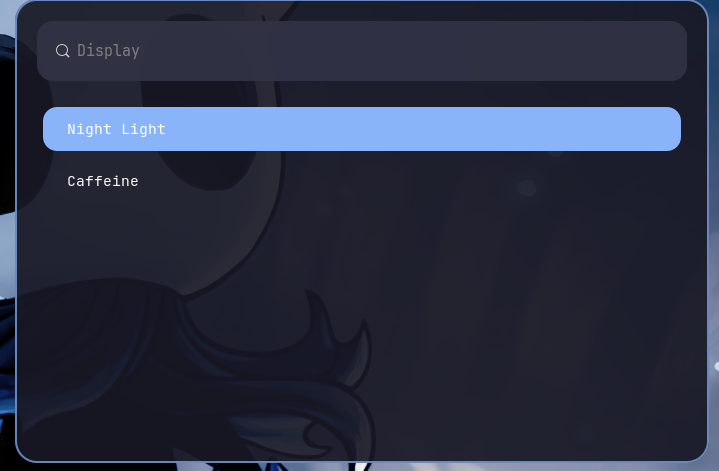
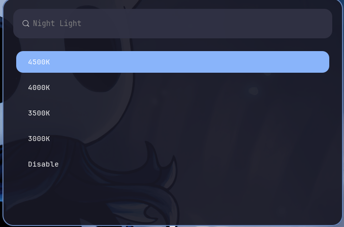
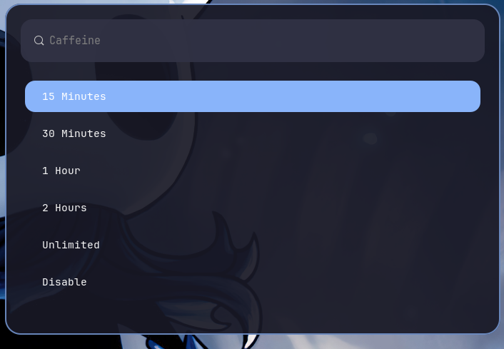

<p align="center">
  
</p>

<h1 align="center">Monarch-Sway</h1>

<p align="center">
  A clean, minimal and modular SwayWM rice built for productivity, consistency and polished Wayland workflows.
</p>

<p align="center">
  
  
  
</p>

<p align="center">
  Minimal • Fast • Modular • Professional
</p>

---

# Overview

Monarch-Sway is a productivity-focused SwayWM configuration built around a clean dark interface with soft blue accents inspired by Material Expressive styling and Omarchy-like minimalism.

The goal is to create a desktop that feels:

* Minimal
* Consistent
* Lightweight
* Readable
* Modular
* Professional

This setup prioritizes usability first, aesthetics second.

---

# What's New in v1.1

Monarch-Sway v1.1 focuses on improving workflow, display controls and system usability while preserving the original Monarch philosophy.

## Productivity

* Quick File Search (`Mod + Shift + F`)
* Clipboard History (`Mod + V`)
* Improved workflow menus

## Display & Power

* Night Light with temperature presets (`Mod + X`)
* Caffeine Mode with duration presets (`Mod + C`)
* Display Settings submenu (`Mod + Esc`)
* Improved Power Profile workflow

## Notifications

* Battery level notifications
* Charging state notifications
* Screenshot notifications
* Recording notifications

## UI

* Transparent Waybar restored
* Additional workflow polish
* Improved consistency across menus

---

# Preview

## Desktop (v1.1)


## Display Settings



## Night Light



## Caffeine Mode



## Quick File Search


---

# Original v1.0 Preview

## Desktop


## Waybar


## Launcher


## Power Menu


## Power Profiles


## Fastfetch


---

# Features

## Core Features (v1.0)

* Clean soft-blue accent UI
* Minimal SwayWM workflow
* Custom modular Waybar setup
* Transparent Waybar styling
* Wofi launcher customization
* Wallpaper picker integration
* Performance menu integration
* Power profile selector
* Do Not Disturb toggle
* Screenshot and recording workflow
* Fastfetch branding
* Mako notifications
* Blur-style lockscreen integration
* Consistent styling across all components

## New Features (v1.1)

* Night Light presets
* Caffeine Mode presets
* Display Settings menu
* Quick File Search
* Clipboard History
* Battery notifications
* Charging notifications
* Improved workflow integration
* Restored transparent Waybar

---

# Stack

| Component      | Package   |
| -------------- | --------- |
| Window Manager | Sway      |
| Status Bar     | Waybar    |
| Launcher       | Wofi      |
| Terminal       | Foot      |
| Notifications  | Mako      |
| Shell          | Zsh       |
| Fetch Utility  | Fastfetch |

---

# Dependencies

## Core Packages

* sway
* waybar
* wofi
* foot
* mako
* fastfetch
* zsh

## Utilities

* grim
* slurp
* wl-clipboard
* brightnessctl
* playerctl
* network-manager
* pavucontrol
* pipewire / pactl
* swaybg
* swayidle
* swaylock

## Additional v1.1 Dependencies

* gammastep
* cliphist
* blueman
* wf-recorder
* nautilus
* power-profiles-daemon

### Ubuntu / Debian Example

```bash
sudo nala install \
  sway \
  waybar \
  wofi \
  foot \
  mako-notifier \
  fastfetch \
  zsh \
  grim \
  slurp \
  wl-clipboard \
  brightnessctl \
  playerctl \
  network-manager \
  pavucontrol \
  swaybg \
  swayidle \
  swaylock \
  blueman \
  wf-recorder \
  nautilus \
  power-profiles-daemon \
  gammastep
```

---

# Installation

Clone the repository:

```bash
git clone https://github.com/sharanfr/Monarch-Sway.git
cd Monarch-Sway
```

Create config directory:

```bash
mkdir -p ~/.config
```

Copy the configuration folders:

```bash
cp -r foot ~/.config/
cp -r mako ~/.config/
cp -r sway ~/.config/
cp -r waybar ~/.config/
cp -r wofi ~/.config/
```

Reload Sway:

```bash
swaymsg reload
```

Or restart the Wayland session.

---

# Folder Structure

```text
Monarch-Sway
├── docs/
├── fastfetch/
├── foot/
├── mako/
├── screenshots/
├── sway/
├── waybar/
├── wofi/
└── README.md
```

---

# Keybindings

All shortcuts are documented in:

```text
docs/keybindings.md
```

## New v1.1 Keybindings

| Shortcut        | Action            |
| --------------- | ----------------- |
| Mod + X         | Night Light       |
| Mod + C         | Caffeine Mode     |
| Mod + Esc       | Display Settings  |
| Mod + Shift + F | Quick File Search |
| Mod + V         | Clipboard History |

Includes:

* App launcher
* Terminal
* File manager
* Screenshot workflow
* Screen recording
* Workspace switching
* DND toggle
* Power menu
* Wallpaper picker
* Lockscreen
* Volume / brightness
* Window controls

---

# Customization

## Sway

Main behavior and keybindings:

```text
sway/config
```

## Waybar

Modules:

```text
waybar/config
```

Styling:

```text
waybar/style.css
```

## Wofi

Launcher config:

```text
wofi/config
```

Styling:

```text
wofi/style.css
```

## Notifications

```text
mako/config
```

## Terminal

```text
foot/foot.ini
```

---

# Wallpaper

Wallpaper references may be customized inside:

```text
sway/config
```

and supporting scripts inside:

```text
sway/scripts/
```

---

# Notes

This rice was built around a personal workflow and may require small changes depending on:

* display resolution
* monitor layout
* distro-specific package names
* audio backend
* tray support
* GPU / rendering behavior
* wallpaper paths
* bluetooth implementation

---

# Release History

## v1.0

Initial public release.

## v1.1

* Night Light
* Caffeine Mode
* Display Settings
* Quick File Search
* Clipboard History
* Battery Notifications
* Charging Notifications
* Transparent Waybar
* Workflow improvements

---

# Philosophy

Monarch-Sway is built around:

> Minimalism without sacrificing workflow.

The intention is to keep the desktop visually clean while remaining fast, practical and modular.

---

# License

Personal configuration.

Free to use, modify and adapt.
