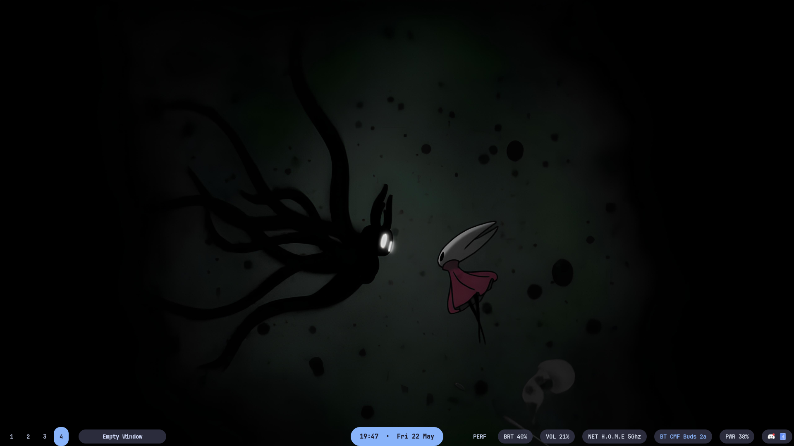
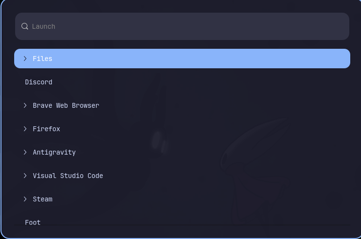
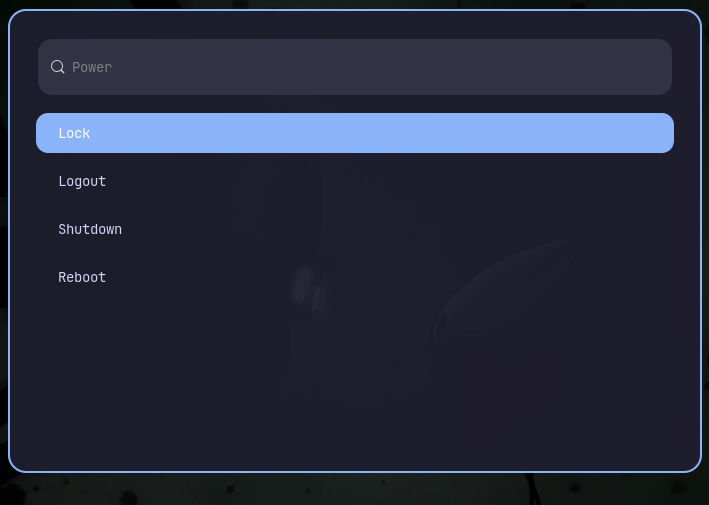
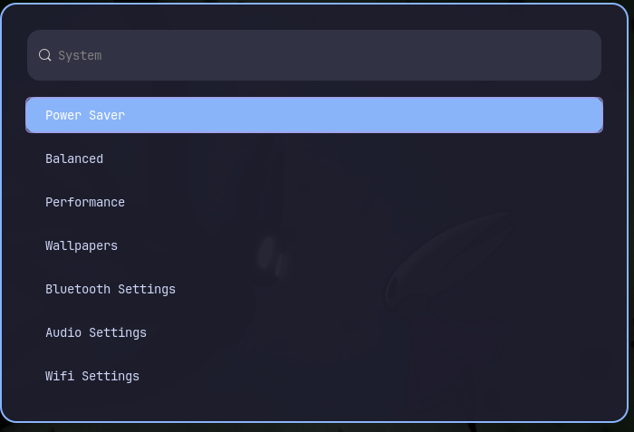
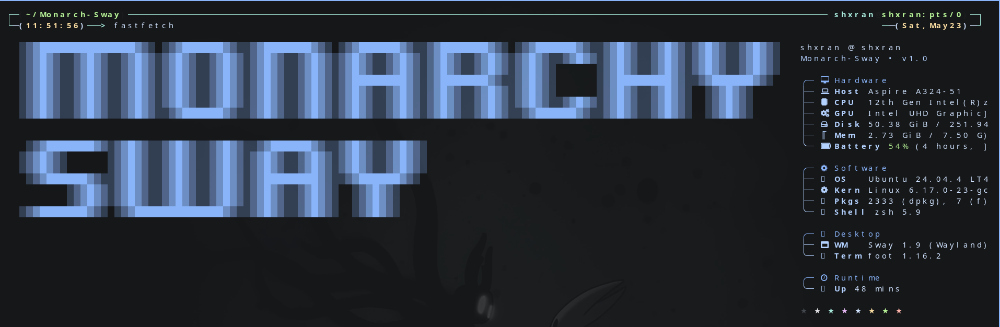

<p align="center">
  
</p>

<h1 align="center">Monarch-Sway</h1>

<p align="center">
  A clean, minimal and modular SwayWM rice built for productivity, consistency and polished Wayland workflows.
</p>

<p align="center">
  
  
  
</p>

<p align="center">
  Minimal • Fast • Modular • Professional
</p>

---

## Overview

Monarch-Sway is a productivity-focused SwayWM configuration built around a clean dark interface with soft blue accents inspired by Material Expressive styling and Omarchy-like minimalism.

The goal is to create a desktop that feels:

- Minimal
- Consistent
- Lightweight
- Readable
- Modular
- Professional

This setup prioritizes usability first, aesthetics second.

---

## Preview

### Desktop


### Waybar


### Launcher



### Power Menu



### Power Profiles



### Fastfetch



---

## Features

- Clean soft-blue accent UI
- Minimal SwayWM workflow
- Custom modular Waybar setup
- Transparent Waybar styling
- Wofi launcher customization
- Wallpaper picker integration
- Performance menu integration
- Power profile selector
- Do Not Disturb toggle
- Screenshot and recording workflow
- Fastfetch branding
- Mako notifications
- Blur-style lockscreen integration
- Consistent styling across all components

---

## Stack

| Component | Package |
|----------|----------|
| Window Manager | Sway |
| Status Bar | Waybar |
| Launcher | Wofi |
| Terminal | Foot |
| Notifications | Mako |
| Shell | Zsh |
| Fetch Utility | Fastfetch |

---

## Dependencies

Install the following before applying the rice.

### Core Packages

- sway
- waybar
- wofi
- foot
- mako
- fastfetch
- zsh

### Utilities

- grim
- slurp
- wl-clipboard
- brightnessctl
- playerctl
- network-manager
- pavucontrol
- pipewire / pactl
- swaybg
- swayidle
- swaylock

Ubuntu / Debian example:

```bash
sudo nala install \
  sway \
  waybar \
  wofi \
  foot \
  mako-notifier \
  fastfetch \
  zsh \
  grim \
  slurp \
  wl-clipboard \
  brightnessctl \
  playerctl \
  network-manager \
  pavucontrol \
  swaybg \
  swayidle \
  swaylock \
  blueman \
  wf-recorder \
  nautilus \
  power-profiles-daemon
```

---

## Installation

Clone the repository:

```bash
git clone https://github.com/YOUR_USERNAME/Monarch-Sway.git
cd Monarch-Sway
```

Create config directory:

```bash
mkdir -p ~/.config
```

Copy the configuration folders:

```bash
cp -r .config/sway ~/.config/
cp -r .config/waybar ~/.config/
cp -r .config/wofi ~/.config/
cp -r .config/foot ~/.config/
cp -r .config/mako ~/.config/
cp -r .config/fastfetch ~/.config/
```

Reload Sway:

```bash
swaymsg reload
```

Or restart the Wayland session.

---

## Folder Structure

```bash
Monarch-Sway
├── .config/
│   ├── fastfetch/
│   ├── foot/
│   ├── mako/
│   ├── sway/
│   ├── waybar/
│   └── wofi/
│
├── docs/
│   └── keybindings.md
│
└── screenshots/
```

---

## Keybindings

All shortcuts are documented here:

```bash
docs/keybindings.md
```

Includes:

- App launcher
- Terminal
- File manager
- Screenshot workflow
- Screen recording
- Workspace switching
- DND toggle
- Power menu
- Wallpaper picker
- Lockscreen
- Volume / brightness
- Window controls

---

## Customization

### Sway

Main behavior and keybindings:

```bash
.config/sway/config
```

Edit for:
- keybindings
- startup apps
- workspace behavior
- floating windows
- power menus
- wallpaper integration

---

### Waybar

Modules:

```bash
.config/waybar/config
```

Styling:

```bash
.config/waybar/style.css
```

Edit for:
- clock
- tray
- battery
- bluetooth
- network
- performance menu
- layout spacing
- colors
- transparency

---

### Wofi

Launcher config:

```bash
.config/wofi/config
```

Styling:

```bash
.config/wofi/style.css
```

---

### Fastfetch

Configuration:

```bash
.config/fastfetch/config.jsonc
```

ASCII branding:

```bash
.config/fastfetch/ascii.txt
```

---

### Notifications

Mako config:

```bash
.config/mako/config
```

---

### Terminal

Foot config:

```bash
.config/foot/foot.ini
```

---

## Wallpaper

Wallpaper references may be customized inside:

```bash
.config/sway/config
```

and supporting scripts inside:

```bash
.config/sway/scripts/
```

---

## Notes

This rice was built around a personal workflow and may require small changes depending on:

- display resolution
- monitor layout
- distro-specific package names
- audio backend
- tray support
- GPU / rendering behavior
- wallpaper paths
- bluetooth implementation

---

## Philosophy

Monarch-Sway is built around:

> Minimalism without sacrificing workflow.

The intention is to keep the desktop visually clean while remaining fast, practical and modular.

---

## License

Personal configuration.  
Free to use, modify and adapt.
